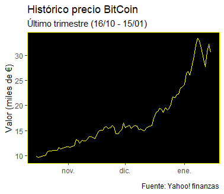
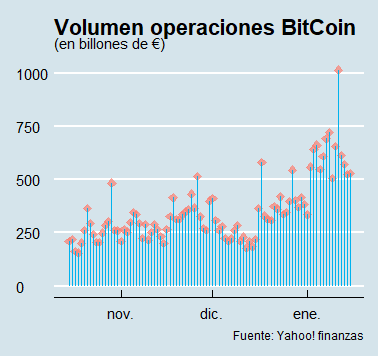
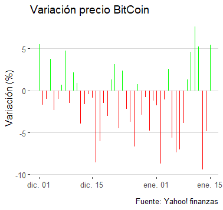

```{r packages-setup, include = FALSE}
library(tidyverse)
library(here)
library(rio)
library(ggplot2)
library(tidyverse)
library(spathial)
library(dplyr)
library(ggthemes)
library(reshape2)
library(jpeg)
library(png)
library(klippy)  #- remotes::install_github("rlesur/klippy")
library(knitr)
```

```{r chunk-setup, include = FALSE}
knitr::opts_chunk$set(echo = TRUE, eval = TRUE, message = FALSE, warning = FALSE, 
                      #results = "hold",
                      cache = FALSE, cache.path = "/caches/", comment = "#>",
                      #fig.width = 7, #fig.height= 7,   
                      #out.width = 7, out.height = 7,
                      collapse = TRUE,  fig.show = "hold",
                      fig.asp = 7/9, out.width = "60%", fig.align = "center")
knitr::opts_chunk$set(dev = "png", dev.args = list(type = "cairo-png"))
```

```{r options-setup, include = FALSE}
options(scipen = 999) #- para quitar la notación científica
options("yaml.eval.expr" = TRUE) 
```


```{r klippy, echo = FALSE}
klippy::klippy(position = c("top", "right")) #- remotes::install_github("rlesur/klippy")
```

<hr class="linea-black">

Trabajo elaborado para la asignatura "Programación y manejo de datos en la era del Big Data" de la Universitat de València durante el curso 2020-2021. El repo del trabajo está [aquí](https://github.com/Nacho-CP/trabajo_BigData){target="_blank"}. La página web de la asignatura y los trabajos de mis compañeros pueden verse [aquí](https://perezp44.github.io/intro-ds-20-21-web/07-trabajos.html){target="_blank"}.

<!-- El párrafo de arriba has de dejarlo casi igual, 
        solo HAS de SUSTITUIR las 2 veces que aparece "perezp44" por tu usuario de Github-->

<hr class="linea-red">

# 1. Introducción

Este trabajo tiene por objetivo estudiar la evolución en el precio de la criptomoneda de referencia en el mundo, así como determinar posibles causas de las fuertes fluctuaciones que este experimenta.

```{r, eval = FALSE, echo=FALSE}
2 + 2
```


# 2. Datos

Los datos han sido descargados de [Yahoo! finanzas](https://es.finance.yahoo.com/), concretamente de la 
[página dedicada al BitCoin](https://es.finance.yahoo.com/quote/BTC-EUR/history?p=BTC-EUR). Ambas son totalmente gratuitas.

```{r, eval = FALSE, echo=FALSE}
ggplot(iris, aes(Sepal.Length, Petal.Length)) + geom_point()
```


## 2.1. Procesando los datos

Para transmitir correctamente los argumentos que se exponen, es necesario trabajar con las variables y las representaciones oportunas. 

El primer paso ha sido escoger uno de los 4 precios que contiene la tabla, en este caso el de cierre de la sesión, el único que no ha sido eliminado.

```{r, eval = FALSE, echo=TRUE}

df <- import("./datos/BTC-EUR.csv")

df1 <- df %>% select(-c("High", "Low", "Adj Close"))

```


## 2.2 Creación de los gráficos

Aunque todos parten del mismo archivo, para crear los gráficos se han realizado diferentes transformaciones del mismo, ya que representan la evolucion de diferentes variables.

### 2.2.1 Evolución del precio

Para mejorar la apariencia, he transformado las unidades de la escala, y cambiado los colores del gráfico.


```{r, eval = FALSE, echo=TRUE}
evol_var1 <- df1 %>%  mutate(Value = Close/1000)

evol_val <- ggplot(evol_var1, aes(Date, Value)) +
  geom_line(color = "yellow")


evol_val +
  labs(title = "Histórico precio BitCoin",
            subtitle = "Último trimestre (16/10 - 15/01)",
            caption = "Fuente: Yahoo! finanzas",
            x = element_blank(),
            y = "Valor (miles de €)") +
  theme(panel.background = element_rect(fill = "black", colour = "yellow"),
        panel.grid.major = element_blank(),
        panel.grid.minor = element_blank())

```


<center></center>


### 2.2.2 Evolución del volumen

Para estudiar la evolución del volumen de los intercambios de BitCoin, de nuevo he cambiado la unidad de la escala, para que cupiesen los números en el eje y he empleado una plantilla que permite una mejor visualización


```{r, eval = FALSE, echo=TRUE}

vol_month1 <- df1 %>%  mutate(Volume = Volume/100000000)

vol_month <- ggplot(vol_month1, aes(Date, Volume)) +
                    geom_point(size = 2, color = "salmon",  fill = alpha("salmon", 0.5), alpha = 0.7, shape = 23) +
                    geom_segment( aes(x = Date, xend=Date, y = 0, yend = Volume), color = "deepskyblue2")


vol_month + theme_economist() +
            labs(title = "Volumen operaciones BitCoin",
            subtitle = "(en billones de €)",
            caption = "Fuente: Yahoo! finanzas",
            x = element_blank(),
            y = element_blank())

```

<center></center>


### 2.2.3 Variación diaria

Este ha sido algo más complicado ya que R no posee un operador para calcular el incremento de una varibable, por lo que he optado por extraer los precios como un vector y duplicarlo para poder calcular las variaciones en porcentaje. Para abreviar, el vector de incrementos tiene una fila mas, que hay que eliminar para introducirla en el dataframe y poder trabajar; para que se vea bien he cogido las observaciones del último mes y medio, ya que cada línea corresponde a un diaº


```{r, eval = FALSE, echo=TRUE}

v1 <- df1%>% pull(Close)

v2 <- append(v1, 0, 0)

variation <- ((v2-v1)/v1)*100

df_2 <- data.frame(variation) %>% slice(-c(94))

var<- df1 %>% bind_cols(df_2)


var_1 <- var %>% slice(-c(1)) %>% mutate(mycolor = ifelse(variation<0, "red", "green"))

aa<- var_1 %>% slice(47:92)


var_mes <- ggplot(aa, aes(Date, variation, color= mycolor)) +
        geom_segment(aes(x = Date, xend = Date, y = 0, yend = variation))


var_mes + scale_colour_manual(values=c("red", "green"), name="",
              guide=guide_legend(nrow=4)) +
              theme_hc()+
                theme(legend.position = "none") +
            labs(title = "Variación precio BitCoin",
                caption = "Fuente: Yahoo! finanzas",
                x = element_blank(),
                y = "Variación (%)")
```

<center></center>

# 3. Trabajos en los que te has basado

Ya tenía pensado hablar sobre algo relacionado con la bolsa, y como a finales de año se produjeron algunos hechos relevantes relacionados con el BitCoin, que fueron publicados en [Cincodías, el diario económico de El País](https://cincodias.elpais.com/), finalmente me decidí a hacer el trabajo sobre este.
<br></br>
Lo que trato de mostrar con los gráficos no obedece a un artculo en particular; la volatilidad y el aumento del valor de este activo son de sobra conocidos.


# 4. Método de inversión en BitCoin

<br></br>

Ni matemáticos de Harvard ni físicos del MIT, las mejores predicciones sobre la valoración del BitCoin las realiza una [**astróloga del Tik Tok**](https://cincodias.elpais.com/cincodias/2021/01/14/mercados/1610634736_913553.html). Porque si una combinación arbitraria de astros puede predecir como va a ser tu día ¿por que no como va a ser el mercado?


<center></center>


# 5. Preguntas

<center></center>


